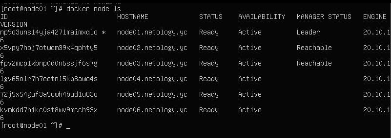

# devops-netology_5.5
1. 

1.1
- replication - число реплик задается вручную для кластера  
- global - запускается на всех доступных нодах кластера  

1.2  
- алгоритм распределённого консенсуса Raft  

1.3  
- Overlay Network - подсеть, которую могут использовать контейнеры в разных хостах swarm-кластера. Контейнеры на разных физических хостах могут обмениваться данными по overlay network  

2.  

3.
  

